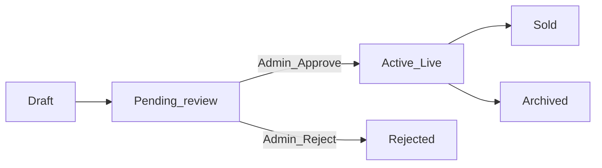

# Marathi Classifieds — Product & Flow Guide

## What we are building

**Marathi Classifieds** is an OLX-style marketplace for Maharashtra users (English + Marathi).

People can:
- Browse and search local ads
- Post items for sale (with photos)
- Chat with sellers
- Save favorites
- Get moderated listings (admin approval before ads go live)

Everything runs in **one Next.js 15 app** (UI + `/app/api` backend), MongoDB Atlas, deployable on Netlify.

---

## Why your product is not on Home / Search

When you click **Publish**, the ad status becomes **`pending`**, not `active`.

| Status | Meaning | Visible on Home/Search? |
|---|---|---|
| `draft` | Still editing | No |
| `pending` | Waiting for admin approval | No (public) |
| `active` | Approved / live | Yes |
| `rejected` | Admin rejected | No |
| `sold` / `archived` | Closed | No |

### How to make it live

1. Login as admin: `admin@marathiclassifieds.com` / `Admin@12345` (or your `ADMIN_*` env values)
2. Open `/en/admin` → **Moderate ads**
3. **Approve** your listing
4. It appears on Home, Search, and Category pages

You can also see your own ads (including Pending) under **Profile → My listings**.

---

## High-level architecture

```text
Browser (UI)
  → Next.js pages + React Query / Zustand
  → /app/api/* Route Handlers
  → Services (business rules)
  → Repositories (MongoDB / Mongoose)
  → MongoDB Atlas

External:
  Cloudinary (images)
  Resend (email OTP)
  Twilio (SMS OTP, optional)
  Pusher (realtime chat)
  Google OAuth (Auth.js)
```

---

## Application lifecycle of an ad



1. User fills multi-step Sell form → **draft** saved
2. User publishes → **pending**
3. Admin approves → **active** (public)
4. Buyers browse, favorite, chat
5. Seller marks sold / archives later

---

## User flow (buyer + seller)

### A) New user / seller

1. Open `/en` (or `/mr`)
2. **Register** → email/phone + password → OTP verify
3. Land on Sell (or Home)
4. **Post an ad**
   - Choose category (+ optional subcategory)
   - Details, price, city
   - Upload photos (Cloudinary)
   - Preview → **Publish**
5. Ad is **Pending review**
6. After admin approval → ad is live
7. Buyers can open ad → **Chat** / **Favorite**

### B) Buyer

1. Home: Featured / Latest / Categories
2. Search with filters (price, category, sort)
3. Open ad detail → gallery, seller card
4. Login if needed → Chat with seller
5. Save to Favorites
6. Optionally rate seller later

### C) Returning user

1. Login (email/phone + password, or Google when configured)
2. Access Sell, Chat, Favorites, Profile, Notifications

---

## Admin flow

Admin role is seeded by `npm run seed`.

1. Login as admin
2. Go to `/en/admin`
3. **Dashboard**: counts (users, pending ads, reports)
4. **Moderate ads**: Approve / Reject pending listings
5. **Users**: Ban abusive accounts
6. **Reports**: Resolve user reports
7. **Analytics**: overview stats

Without admin approval, public marketplace stays empty of new posts.

---

## Main UI routes

| Route | Who | Purpose |
|---|---|---|
| `/[locale]` | Public | Home |
| `/[locale]/search` | Public | Marketplace + filters |
| `/[locale]/categories/[slug]` | Public | Category + subcategories |
| `/[locale]/ads/[id]` | Public | Ad detail |
| `/[locale]/login` `/register` `/verify-otp` | Guest | Auth |
| `/[locale]/sell` | Auth | Post ad |
| `/[locale]/chat` | Auth | Inbox |
| `/[locale]/favorites` | Auth | Wishlist |
| `/[locale]/profile` | Auth | Profile + My listings |
| `/[locale]/notifications` | Auth | In-app notifications |
| `/[locale]/admin/*` | Admin | Moderation panel |

---

## API map (`/app/api`)

### Auth & OTP
| Method | Endpoint | Notes |
|---|---|---|
| POST | `/api/auth/register` | Start registration (sends OTP) |
| POST | `/api/auth/login` | Email/phone + password → JWT cookies |
| POST | `/api/auth/logout` | Clear cookies |
| POST | `/api/auth/refresh` | Refresh session |
| GET | `/api/auth/me` | Current user |
| GET/POST | `/api/auth/[...nextauth]` | Google OAuth (Auth.js) |
| POST | `/api/otp/send` | Send OTP (Resend / Twilio / console) |
| POST | `/api/otp/verify` | Verify OTP; completes registration |
| GET | `/api/csrf` | CSRF token |

### Users
| Method | Endpoint | Notes |
|---|---|---|
| GET/PATCH | `/api/users/me` | Own profile |
| GET | `/api/users/[id]` | Public seller profile |
| POST | `/api/users/[id]/rate` | Rate a seller |

### Categories & Ads
| Method | Endpoint | Notes |
|---|---|---|
| GET | `/api/categories` | All categories |
| GET | `/api/categories/[slug]` | One category |
| GET | `/api/ads` | List/filter (default **active** only; sellerId shows own statuses) |
| POST | `/api/ads` | Create ad |
| POST | `/api/ads/draft` | Save draft |
| GET | `/api/ads/featured` | Featured active ads |
| GET | `/api/ads/nearby` | Geo nearby |
| GET | `/api/ads/search` | Atlas Search / text fallback |
| GET/PATCH/DELETE | `/api/ads/[id]` | Detail / update / delete |
| POST | `/api/ads/[id]/publish` | draft → **pending** |

### Favorites, Chat, Reports, Notifications
| Method | Endpoint | Notes |
|---|---|---|
| GET/POST | `/api/favorites` | List / add |
| DELETE | `/api/favorites/[adId]` | Remove |
| GET/POST | `/api/chats` | Inbox / start chat |
| GET/POST | `/api/chats/[id]/messages` | Thread |
| POST | `/api/chats/[id]/read` | Read receipts |
| POST | `/api/chats/[id]/typing` | Typing (Pusher) |
| POST | `/api/pusher/auth` | Private channel auth |
| GET/POST | `/api/reports` | Create / list (admin) |
| GET/PATCH | `/api/notifications` | List / mark read |

### Uploads & Health
| Method | Endpoint | Notes |
|---|---|---|
| POST | `/api/uploads/sign` | Cloudinary signed upload params |
| GET | `/api/health` | Health check |

### Admin
| Method | Endpoint | Notes |
|---|---|---|
| GET | `/api/admin/ads` | Pending queue |
| POST | `/api/admin/ads/[id]/approve` | pending → **active** |
| POST | `/api/admin/ads/[id]/reject` | pending → rejected |
| GET | `/api/admin/users` | Users |
| POST | `/api/admin/users/[id]/ban` | Ban/unban |
| GET/PATCH | `/api/admin/reports` | Moderate reports |
| GET | `/api/admin/analytics` | KPIs |

---

## Quick checklist for you right now

1. Open **Profile** → confirm your ad shows as **Pending review**
2. Login as **admin**
3. `/en/admin/ads` → **Approve**
4. Refresh Home / Search → ad should appear
